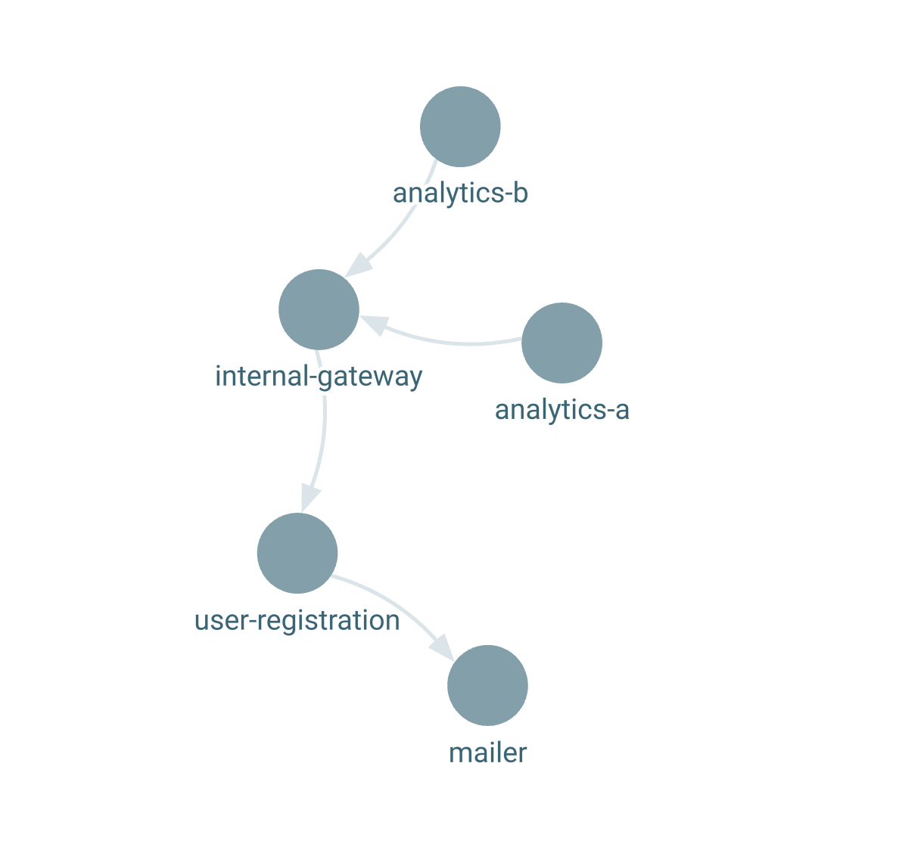

# CodeGraph

### Functionality

...Work in progress...

### Usage

Example usage:

- find all files in example folder
- pass them all to codegraph binary
- lastly, load visualizer in the browser

```
task examples-generate
task examples-visualizer
```

Will generate file as:

```
[
  {
    "type": "label",
    "value": "handler-consumer-execute-a",
    "filepath": "./examples/javascript/service-handler-consumer.js",
    "position": {
      "row": 2,
      "column": 3
    }
  }, ...
]
```

Visiting the visualizer app on http://localhost:3000/:


## Development setup

Install & build:

```
task setup-pnpm
task compile
```

To list all tasks:

```
task --list-all
```
